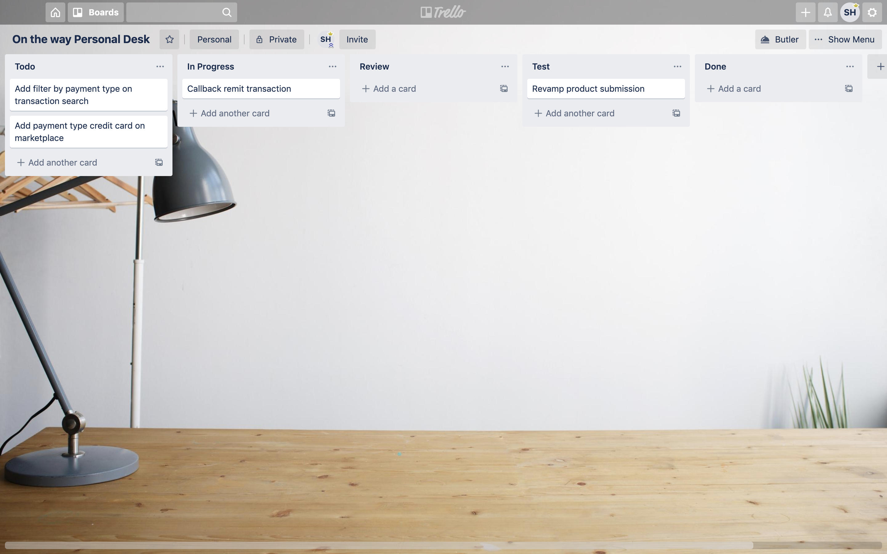
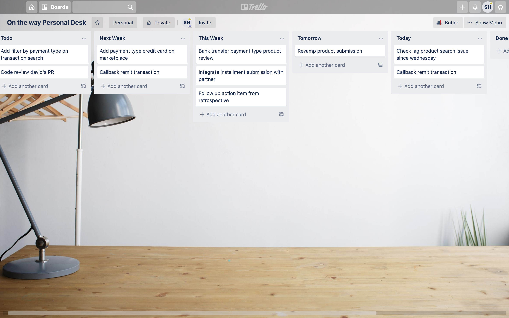
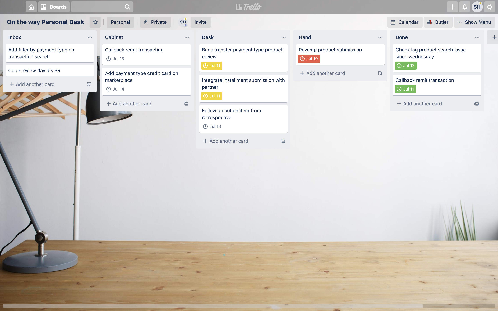
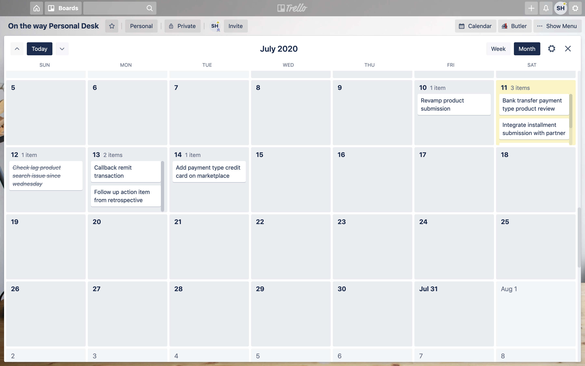
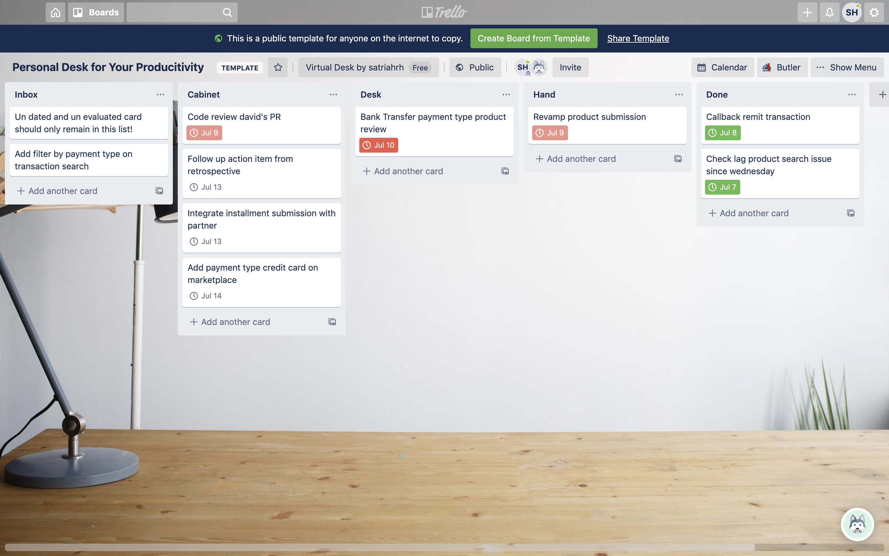

You are a software engineer or employee at an IT company, because this is who I am, though this story can be applicable for anyone.
Your daily busy tasks would be technical related like do some code, code review, meeting with product, check production alert, operational task, etc.
Once you fall into a managerial career such as tech lead, I can guarantee you that your life no longer will be the same as before.
To handle such a mess, I recommend you to clean up your day by bringing a personal productivity board to your work routine.

This is my case that I tell you, very specific, very technical and maybe not related to you as a non software engineer.
But I will tell you as general as possible, so you can take me as an example to build your own board.

## Built up from Kanban Board

First, I came up with this epic kanban board consisting of a list of Todo, In Progress, Review, Test, Done.
If you are a software engineer alike, this is a suitable board for you if your only task is coding.
But you will get your board such a lonely board because typically this board is suitable for a team instead of an individual.

On the way to build up my productivity board, this kind of kanban board is blacklisted from my option list by default.
Obviously not suitable for my needs, though I still made this board as my very first inspiration to build up a board in a column of task where the column represents the current state of the task.

## Accommodates any kind of task and brings focus

Once I arrived at this point, the new board of mine is applicable for any kind of task.
By this point, anything your job position will be suitable for this board! Welcome to the club yay.

I put up some a feature to give me focus.
Which task remain untouched Todo.
Taking focus on day by day, which task should I finish by Today or Tomorrow.
Too difficult to state in a day, put the task on Next Week or This Week.

Remember that any task first comes up in Todo.
No task in Todo means all of the tasks have been evaluated when to finish.
Ultimately you should definitely have Done as a reward for yourself in finishing the task.

I got a chance to experience this type of board for some moments at unbelievable pleasure.
The aura of neat and tidy which brings joy in your life began to climb up from your desk.
That was it until at some moment I lost control on updating where to put that task and allocating and scheduling the task regularly.

> DISCLAIMER!
> That version of my board is inspired by this article https://blog.trello.com/work-life-focus-trello-insider-guide-personal-productivity

## Schedule and priority

Two things that I forgot from my previous board was schedule and priority.
After some exhausting weeks in using the previous board by regular update and over focus, I got a vision on how to clean up this mess starting from how I look at my desk.

I saw myself sitting behind my desk, coming to my desk with some stack of tasks which remain unknown.
The place where I put those messy tasks is Inbox, that’s what it is right?

After some moments of evaluation, should be in no time, I sorted those tasks by delivery deadline.
Hey, don’t forget to write when the deadline is.
Remember that everything is unexpected, you should be aware that those deadlines you set previously will be updated according to the situation.
Put those tasks in a Cabinet, because I want a free space in my desk where I can focus on what I am doing now.

I am ready to work?
Take some tasks to my Desk because I am sure that I can finish some of them by today.

I am taking the first task from the edge of my Desk to my Hand.
I am extremely focused on doing it, awesome! I am finished now!

So sad, apparently the result of my task should be reviewed by my peers.
That’s ok because you can hand it off to them.
But virtually I am still working on it right?
I am still taking that task on my Hand right? Leave them up for a moment.
Time to take the second task from my Desk onto my Hand!

This time I am also working on my task super effectively!
I finish it in no time.
As I reward, I want to give myself a reward for my task completion by virtually putting the task on the Done list.
Until I get bored, I can archive that list so it emptied out.

Previously, I still had ongoing tasks on my Hand!
Remember the one I asked my peers for review?
He also worked reviewing my task honestly, but it turned out it was really great that none had to be revised.
Put it on my Done list as a reward once more, that to be honest I will put any finished task to Done list as a ritual.

Today’s task is all finished, none in my Desk.
But look, there are some tasks in Inbox that I needed to sort out.
Thanks for today's hype, I can take some more tasks from the Cabinet so that I can finish those tasks early on.

## I use Trello

Lucky you could have a virtual desk on Trello.
You could bird eye view your tasks in Calendar view.
Easier to reschedule and allocate your Inbox or take early tasks from Cabinet.

Since I was also using Trello, it is actually still one thing you can do to boost your productivity.
Using a paid version of trello that gives tons of cool features to automate your board even integrate your board to some working channel.
I can’t tell you right now, sorry Trello ain’t nothing to give you a free exposure here 😂

## Afterwords

That was it, a giant leap into my productivity so far.
Very basic, very simple to bring joy in your life, even vanish frown on my forehead.
It only cost $0 until I was eager to share this experience to you all.
No time to set up your board, create your own board from my template [trello.com/b/rrtDK8YN](https://trello.com/b/rrtDK8YN) and you will be ready to go.
