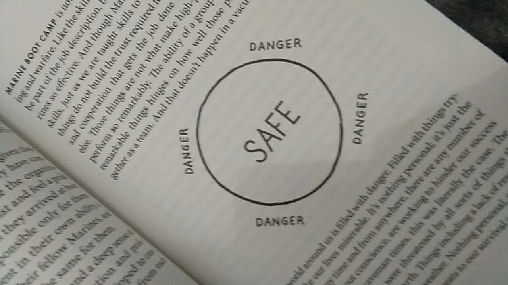

A few days ago, my wife asked me to buy a book.
This time, she asked me a book named [Leaders Eat Last](https://www.goodreads.com/book/show/16144853-leaders-eat-last) by Simon Sinek.

I supposed, that book was for me since she obsessed with me being a leader in a workplace organization.
It is true though, the book is for me to read and so I can learn from it.
She caught on an Instagram story of someone posting a newly bought book and made my wife inspired to buy it too.

Since the day I bought that book from a local imported book store, I haven't read much on it.
I have only read three chapters with forewords, and yes I always read forewords and I will tell you why I read forewords on an upcoming post.

As the title said it was about how we should behave as a leader, that eats last.
The author actually a new york times bestseller who wrote another best selling book [Start With Why](https://www.goodreads.com/book/show/7108725-start-with-why).
The current book I bought, Leaders Eat Last, apparently is a kind of successor of the previous book, Start With Why. And that's what makes me wonder what that previous book tells about.

As far as I read it, my favorite part is when the author tells us about The Circle of Safety.
Surprisingly, I came across the Internet and type The Circle of Safety, and it pops out so many articles about it and even comes from Simon Sinek itself.

## What is The Circle of Safety?

The author began the explanation from a story of US Marine recruits.
But this is my post, and I want you to explain it in my way.

Let's begin by remembering SpongeBob SquarePants at The Camping Episode.
It is when SpongeBob and Patrick decide to camp in their front yard.
Then it came a sea bear bringing disaster and the only one that can save from its attack is the anti sea bear circle.

That's it, The Circle of Safety is like anti sea bear circle.
It can protect anyone inside from danger from outside. It also makes sure anyone inside brings no harm but safe.

According to Simon Sinek, maintaining The Circle of Safety will bring more productivity.
The strongest the circle, the more productive the team could be.

## How to Create The Circle of Safety

As you can see from the illustration from the book, there are components that make the circle: borderline, the safety that always goes inside borderline, the danger that always goes outside borderline.

Actually, Simon didn't tell explicitly of these three components.
It is just the way I understand and I hope it brings help for you to understand what Simon means.

### The Borderline

Borderline is the separator of the safety and the danger.
As I understand, the leader is able to differentiate what brings harm to the team and what brings safety to the team.

### The Safety that Always Goes Inside

Anything or anywho that brings safety should be taken inside.
You can imagine any means of safety.
The key to safety is anything brings good deeds to the team.

Given team members are A, B, C, and D as the leader.
At the time being, there is E who is the direct superior of that team.
E always give good feedback to the team.
Then the entire should consider E as the safety who should be taken inside the circle of safety.

### The Danger that Always Goes Outside

As opposite to safety, anything or anywho that brings danger should be taken outside. It doesn't matter however bringing the one who previously inside to goes outside. It is the job of the entire team to make sure The Circle that always Safe from The Danger.

Given previous team member are A, B, C, and D.
There is a time that A bring a negative behavior toward the team.
He always tends to complain of anything and blame anyone.
D should be able to see the danger, who is A.
What can the team do? Laying off A directly maybe not the best solution and it is exactly not the way The Circle of Safety means.
Maybe bringing A to an improvement plan is a good idea that will bring them inside to the circle once again.

## Who Is in Charge on Maintaining the Circle

The entire team is the one responsible.
Simon told us that the leader is one of the team members who also need safety inside the circle.
So then if you are a leader or not, keep in mind what The Circle of Safety is.
Always remember there is a borderline to differentiate anything or anywho safe that should go inside and danger that should go outside.
